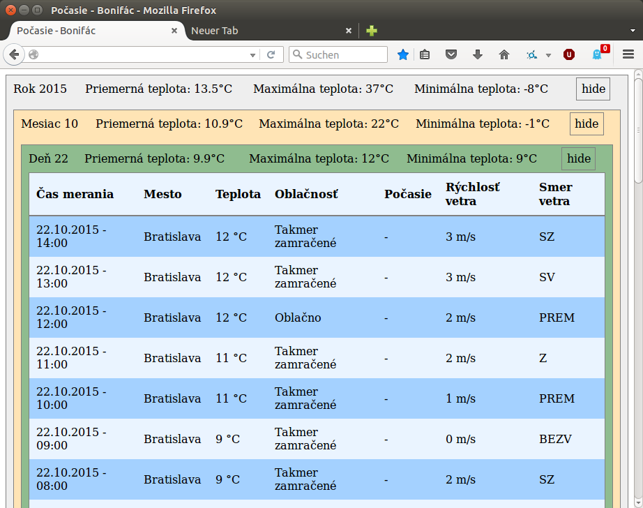
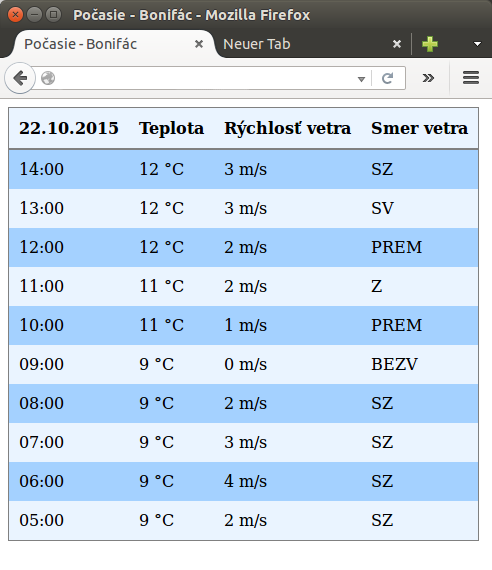

SHMU-extract
============

Parses hourly temperature values for the city Bratislava from the site [SHMU](http://shmu.sk) (slovak weather forecast) and stores them in local MySQL database. 
This is done by the `shmu-extract.py` script, which is desined to be run once (or more) an hour by as a cron job.

The role of the `index.php` and `mobile.php` is to display those data. `json.php` exports the data to json format.

Dependencies
------------
- `python3-bs4` (BeautifulSoup HTML parser)
- `php`